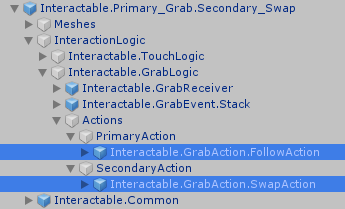

# VRTK Examples - Interactables

[Home](README.md)

## Prerequisites

* You have a basic environment setup. See the scene "Base Scene" for an example. This includes having in your scene...
	* A tracked alias
	* A controller gameobject (Oculus, OpenVR, etc)

## Overview: What are interactables, and interactors?

In VRTK 4.0, we have the concept of `interactables`, and `interactors`. You would configure an `interactor`, which would interact with multiple objects (`interactables`) in the scene. For example, you might have a player's hand, which could pickup a gun, or a pencil.

Currently, this document serves as an overview of what `interactables`/`interactors` are. You can see some examples of `interactables` in this repo, under the `Interactables` scene.

#### Interactors

The `interactor` is typically a child of a tracked alias (eg: TrackedAlias-\>Alias-\>LeftControllerAlias). As the name implies, here we define how the player interacts with the world, and what happens when certain events are triggered. We can define, at a global level, what happens when we...

- Touch an in`teractable` (eg: we touch a button)
- Untouch an `interactable` (eg: we stop touching a button)
- Grab an `interactable` (eg: we grab a gun)
- Ungrab an `interactable` (eg: we let go of a gun)

Whenever one of these events happens, we can call one or more public function from some gameobject in our scene. This is done via the UnityEvent system. 

Example: In the above picture, you can see the different Interactor Events (part of the Interactor VRTK prefab). When the player grabs onto an `interactable` object, MyAction() will be called. This is an arbitrary function that I wrote in the Player class, which is attached to a gameobject called "PlayerLogic".

#### Interactables

The `interactable` is a gameobject that the player can, as you would guess, interact with. In the `interactable`, we can define...

- What happens when the player grabs the object with both hands? Should the second hand...
	- control the direction of the gameobject? (eg: Moving your non-dominant hand while holding a rifle would change the rifle's direction)
	- control the scale of the gameobject? (eg: Pinching both ends of a cube, and having it expand as you move your hands apart)
	- become the primary hand instead? (eg: Hold an apple in your right hand. Now, grab it with your left. In this case, your right hand would let go, and the left hand would become the primary grabber)
	- do nothing!

These all come in the form of prefab gameobjects in VRTK:

We can also configure how the grab action should operate for this object. For example...

- Should the `interactor` let go of the object on a toggle, or should the `interactor` let go of the object when the player releases the button? 
- If I were to grab a gun, I would like to hold it by the handle, not by the object's origin. Likewise, if I'm grabbing a box, I might want to pick it up by the point of where I grabbed it.

Note: See the FAQ section on this page to see how to configure these two settings.

## Example: A simple grab

In this example, we'll setup an `interactor` on each of the player's hands, and place a few `interactable` objects in the scene. The end result should look something like the scene in this repo, `Scenes/Interactables`.

### Configure the interactor

The `interactor` is a prefab included with VRTK, under `Assets/VRTK/Interactions/Interactors`. We'll start by creating an `interactor` for the player's left hand. The same steps can be done to create an `interactor` for the right hand.

In the Project Window, find the `interactor` object, and place it under the left controller alias (`TrackedAlias->Aliases->LeftControllerAlias`). It doesn't have to be here, but it's nice to keep things organized. 

First, we need to set the `interactor`'s Velocity Tracker. As the name implies, this is the gameobject that the `interactor` will follow, as the player moves their controller around the scene. Drag one of your controller aliases into this field.

Secondly, we need to hook up the `interactor` to the rest of our gameobjects. First, we need to pick a BooleanAction that will enable/disable the `interactor`. Under the prefabs for our controllers, there are gameobjects with a BooleanAction script. These scripts fire Boolean values, via the UnityEvent system, depending on whether or not a specific button is pressed. We COULD hook up this BooleanAction to our `interactor` directly: What if we want to support multiple controller types? We'd have to have an `interactor` for each different type of controller - and you'd have a hell of a time managing button layouts. The solution is to create a new BooleanAction to act as a proxy! This proxy BooleanAction would be the true trigger for the `interactor`, and it would take input from one or more BooleanActions (ie: each controller/input that we want to listen for).

1. We'll create the proxy action for the left-handed grab now. Create an empty gameobject anywhere in your scene, and add the BooleanAction component to it (Click "Add Component", and search for that name). Since this gameobject stores a BooleanAction that represents a left-handed grab action, name it something like "Left Hand Grab".

2. Next, we need to find the gameobject that represents the button you want to press to trigger the grab. Under your controller prefabs, there should be a handful of existing gameobjects that represent the different available buttons. 

If you're not finding the button you want to use, or you want to create a new button (eg: keyboard input, or input for a different button keycode), then you can make one yourself! Ceate a gameobject for it, and add a `Unity Button Action` component to it. Set the Key Code field to whatever button you want to listen for. Note: Some buttons on VR controllers are analog, not digital. For example, the original Oculus Rift trigger buttons are this way. Because they return a float input (ie: how far is this button pressed) rather than a boolean input (ie: is this button pressed or not?), their workflow is a bit different. [Take a look at the VRTK How To guide on converting a Float Action to a Boolean Action](https://academy.vrtk.io/Documentation/HowToGuides/Actions/ConvertingAFloatActionToABooleanAction/). TL;DR: You need to use a `Float To Boolean` component, and hook that up to a Boolean Action, defining a threshold that determines how much the button has to be pressed to emit a True value.

3. Now that we have our components for button presses, we can hook them up! Take a look at the below diagram below for the final result. In our proxy action, we have an array field called `Sources`. Add one to the size, and you'll see a new element gets added. We'll be dragging a gameobject that has a BooleanAction component into this slot, more specifically, the gameobject that we found/made in step 2.

Next, we'll hook up the proxy action to our `interactor`. Drag the proxy action gameobject that we made in step 1 ("Left Hand Grab" in our example") into the `interactor`'s `Grab Action` field.

Your `interactor` should look something like the diagram below when done. Repeat the same for the right hand when you're ready - the `interactables` in the next step act differently when we grab them with two hands.

### Configure the interactable

The `interactable` is a prefab included with VRTK, under `Assets/VRTK/Interactions/Interactables`. There's a few different prefabs here that begin with "Interactable.Primary_Grab". The only difference between them, is what would happen if the player grabbed the object with both hands at the second time. The different possibilities are mentioned above under "Interactables". Try them all out, and see how they feel!

All that you need to do to setup an `interactable` is to drag it into the scene! It already comes with a default cube gameobject, which has a `Collider` and a `Mesh Renderer`. This gameobject can of course be replaced with whatever gameobject/prefab you want to use.

We can also configure what happens when the player handles this `interactable`. Maybe when the player grabs a gun, we should start spawning enemies. In our `Interactable` prefab, we have Touch Events and Grab Events. These accept any gameobject, and can call any public function from its attached components, when the event is triggered.

## FAQs / Tips and Tricks

#### How can I configure the interactor to let go on a toggle, instead of letting go when the player releases the grab button?

This is configured under your `interactable`. 

Go to `[your interactable]->InteractionLogic->Interactable.GrabLogic->Interactable.GrabReceiver`. You can set the Grab Type field to either "Hold Till Release", or "Toggle".

#### How can I configure where the object snaps to when it's grabbed?

This is configured under your `interactable`. The gameobject names will vary depending on what action type your `interactable` is using (eg: follow, control direction, swap, etc). 

Go to `[your interactable]->InteractionLogic->Interactable.GrabLogic->Actions->[Primary|Secondary]Action->Interactable.GrabAction.[ActionType]`. Here, you can set the "Grab Offset" field":

- None: Default. Snaps to the origin of the `interactable`.
- Precision Point: The `interactable` will follow the point where the player grabs.
- Orientation Handle: Snaps to the transform of the orientation handle, which is a child of this gameobject (`Dependencies->OrientationHandles`). 
	- So, you could have any gameobject as a child of the `OrientationHandles` gameobject, and the `interactable` will follow that transform.

## See also

[VRTK 4.0 Documentation: Interactions](https://academy.vrtk.io/Documentation/HowToGuides/Interactions)
